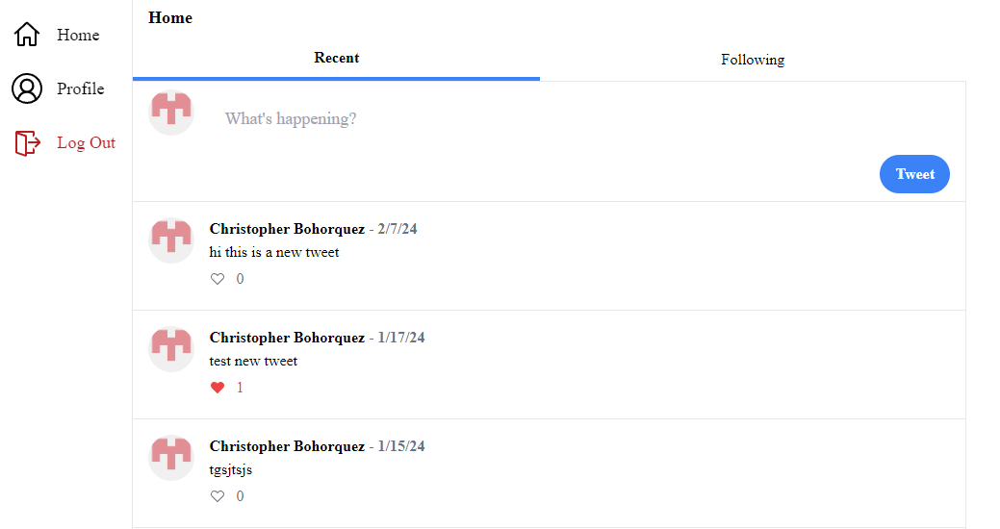

# Social Media App

This project is a social media application that allows users to connect, share, and engage with content in a dynamic online community. Built using the [T3 Stack](https://create.t3.gg/), this app leverages the best practices of modern web development to provide a scalable and maintainable platform.

This is my first time using the T3 stack, and the only trouble I had was using tRPC. I'm still a beginner with it after watching a few tutorials on YouTube, so it's still a bit confusing.

Key features of this Social Media App include:

- User authentication and profile management using [NextAuth.js](https://next-auth.js.org).
- Real-time data fetching and mutations with [tRPC](https://trpc.io).
- A robust database schema designed with [Prisma](https://prisma.io), allowing for complex queries and data relations.
- Responsive and modern UI components styled with [Tailwind CSS](https://tailwindcss.com).
- Infinite scrolling for a seamless user experience.
